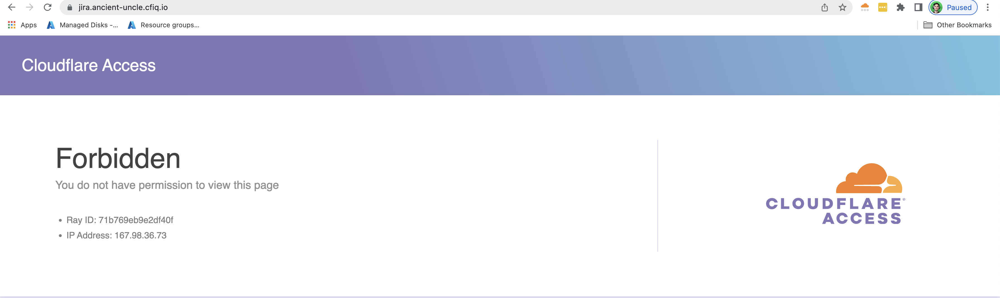
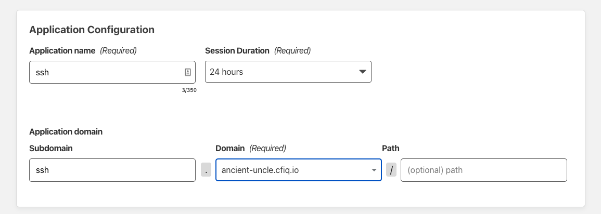
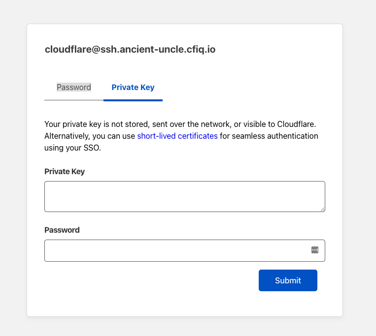

# Cloudflare Zero Trust Network Access Lab
Welcome to to the ZTNA Lab - this lab will focus on connecting multiple applications to Cloudflare over a single tunnel via our app connector Cloudflare Tunnel, and applying Zero Trust rules on top of your application after onboarding it to Cloudflare Access. 

## SSH access to the lab
Start by opening either powershell or terminal (Windows/Mac, respectively). We'll use this to SSH into our origin server, an Ubuntu 20.04 VM. Below is a link to the private key you'll need to access the system. 

First you will need a private key to access the VMs to do this securely you will need to create a new file on your device 

1. open your favorite text editor 
2. create a new empty file 
3. paste the contents from [here](https://zt-access-london-lab.cf-tme.workers.dev/)
4. save the file locally with filename `id_rsa`
```{admonition} File Extension
:class: warning
Be aware that some text editors will try to give the file an extension (eg. txt) for compatability and avoiding encoding issues be sure to remove any auto added file extension, and in windows select "all files" as the type from the dropdown
```

Run the following command in powershell/terminal to access with the username+password cloudflare `#savetheinternet`

```sh
ssh -i [privatekey file] cloudflare@<lab-slug>.cf-tme.com
```

Replace <lab-slug> with your assigned name. You should have SSH access to your device.

## Create a tunnel for Jira
Keep that SSH terminal up, but go back to your Zero Trust dashboard. 

Select Access >> Tunnels and create a brand new tunnel. Name it whatever you'd like.


Next, you'll see the following screen. These are pre-baked commands that you'll need to copy into your SSH terminal in order to establish connectivity to Cloudflare. When you do, you'll see your device pop up in the 'connectors' screen.


Once you see your server appear there, go to the next page.

Here, you're going to configure your public-facing hostname and the service it'll run. Since we're configuring jira, I've called my hostname jira.ancient-uncle.cfiq.io

The service will be HTTP localhost:8000


Save the tunnel once you've entered that in.

## Onboard Jira to Cloudflare Access

Now that you have the tunnel, let's go to Cloudflare Access and onboard our first application. 

Add an application, and select "Self-Hosted" from the options available


Then, fill in the following information

- on the first page, enter the application name, and then the domain + hostname (subdomain) you configured for your tunnel


- on the next page, set up who has access to this application. For the purposes of this exercise, only enter your own email into the 'include' field.


- then, for the final page, no additional configuration is required. go ahead and save the application. If you don't see your VM on the Access page, refresh it.

## Test access to Jira
We've configured Jira, but let's try and access it now. Navigate to the domain you onboarded to cloudflare (in this example, jira.ancient-uncle.cfiq.io). You should reach a Cloudflare Access login page.


Use your OTP to authenticate to the application. You should see the Jira setup page after authenticating.


## Add another application to your tunnel

Now, go back into tunnel and edit your existing tunnel configuration. 


Above the existing hostname you configured, select 'add hostname'


We're going to add an application called Juiceshop. Name your subdomain Juiceshop and set the service as HTTP localhost:3000 and save it


## Onboard Juiceshop to Cloudflare Access

You've added a service to your existing tunnel, but you still need to add a new application in Cloudflare Access. Go ahead and repeat the process for adding a self-hosted application, but this time call it Juiceshop instead. 

## Test access to Juiceshop

Try and log into juiceshop.<enter-lab-slug>.cfiq.io. The process should be nearly identical to the last application. The purpose of this is to highlight that you can run multiple web-based applications over Cloudflare Tunnel using any port number.


## Add a Private IP route to your tunnel

Next, we're going to add a Private IP as an application to Cloudflare Access. Go back to the tunnel you just modified and edit it again. Instead of adding a hostname, you'll need to add a private IP instead. When you're on the appropriate page, go back to your open SSH terminal and run an ifconfig. 

Find your device's 10.10.0.0/24 IP address and add it as a /32 (example: 10.10.0.3/32). 


Save the tunnel again. 

## Onboard Private IP application to Cloudflare Access 

Add a Private IP application in Cloudflare Access now. You'll be redirected to a different page than before. 


Fill in the private IP you documented in the tunnel, and continue. This will bring you to a new set of rules.


These rules require no editing, you can simply save the application now

## Test access to Private IP application

Inside the Gateway Lab you configured yesterday, turn on Cloudflare Zero Trust and type in the private IP address of your application. You should be able to access it via the private IP, even though it's on a completely different network.

## ZT Rule Exercise - Multi-Factor Authentication

Now, go back to your ZT dashboard. We're going to apply a device posture rule to your Jira application. Device posture rules can be found in the same area where you included your email in the application (so edit Jira ) 


Instead of selecting an 'include' rule, we're instead going to add a 'require' rule. 

We'll add authentication method and select multi-factor authentication. Save this rule, and then save the application.

Try and log into Jira again. This time it should fail, because your account doesn't have any 2FA methods attached to them.


## Enabling Clientless RBI

Now, we're going to use device posture rules in service of an interesting use case. To do this, however, we'll need to add a new function to your account. 

Go to Settings >> Browser Isolation.


Turn on Clientless Browser Isolation, then manage your Clientless RBI Rules


Add a rule that allows your email address to authenticate to Cloudflare's Clientless RBI service.

Next, go to My Team >> Devices >> Device Posture


Then, add a device posture element, and select gateway from the options.


## ZT Rule Exercise - Gateway

Go back and edit your Jira policy, and remove the multi-factor authentication requirement. Instead, replace it with a gateway requirement. Save the policy and then save the application, and if you're inside your Gateway Windows VM, turn off your WARP device client. 

Try to access the Jira application right now, and you should receive a failure message before you even reach a login page. This is because Cloudflare detects the absence of a gateway or device client on your computer.



Instead, navigate to your Clientless RBI Webpage

<lab-slug>.cloudflareaccess.com/browser


After logging in, you should see a page that looks like this. 


Type in your Jira url and navigate to it. You should reach a login page this time.

## Add Browser-Based SSH app to tunnel

Finally, we're going to expose a non-web application over a webpage with Cloudflare Access. Go back into your tunnel configuration file and edit it one more time

Add a new service for SSH, and save it

## Onboard Browser-Based SSH application to Cloudflare Access

Go back to Access and add this SSH application via the hostname that you just created. However, you'll need to add one more thing in the final settings page.



Make sure you turn on automatic cloudflared authentication, and also select SSH in Browser Rendering. This will allow Cloudflare to render the SSH terminal in the browser.


## Access Browser-Based SSH application

Log into your Browser-Based SSH application, and copy/paste the private key you saved at the beginning of the lab. Then put in your credentials. 



You should see an SSH terminal render in front of you. Try running some commands!

## Congrats! you're done. great job!